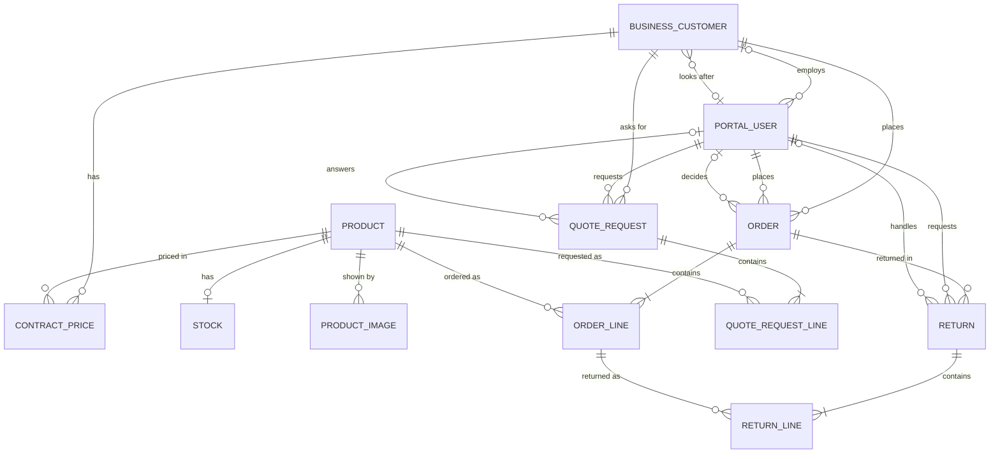

# Entity Model

## Entity Relationship Diagram

### BUSINESS_CUSTOMER

A business that buys from Alpenfeld Supply through the portal.

| Attribute               | Description                                                              | Data Type | Length/Precision | Validation Rules                                  |
|-------------------------|--------------------------------------------------------------------------|-----------|------------------|---------------------------------------------------|
| id                      | Unique identifier                                                        | Long      | 19               | Primary Key, Sequence                             |
| erp_customer_number     | Customer number in the ERP                                               | String    | 50               | Not Null, Unique                                  |
| name                    | Name of the Business Customer                                            | String    | 100              | Not Null                                          |
| order_limit             | Amount above which Orders need an Approval                               | Decimal   | 10,2             | Optional                                          |
| sales_representative_id | Sales Representative who looks after the key account; foreign key to PORTAL_USER.id | Long | 19               | Optional                                          |
| active                  | Whether the Buyers and the Purchasing Manager of the Business Customer can use the portal | Boolean | 1          | Not Null                                          |

### PORTAL_USER

A person who signs in to the portal as a Buyer, Purchasing Manager, Sales Representative, or Customer Service agent.

| Attribute            | Description                                                                 | Data Type | Length/Precision | Validation Rules                                                                 |
|----------------------|-----------------------------------------------------------------------------|-----------|------------------|----------------------------------------------------------------------------------|
| id                   | Unique identifier                                                           | Long      | 19               | Primary Key, Sequence                                                            |
| business_customer_id | Business Customer of a Buyer or Purchasing Manager; foreign key to BUSINESS_CUSTOMER.id | Long | 19               | Optional                                                                         |
| role                 | Role of the user                                                            | String    | 50               | Not Null, Values: Buyer, Purchasing Manager, Sales Representative, Customer Service |
| email                | Address used to sign in                                                     | String    | 255              | Not Null, Format: Email                                                          |
| name                 | Full name of the user                                                       | String    | 100              | Not Null                                                                         |
| active               | Whether the user can sign in                                                | Boolean   | 1                | Not Null                                                                         |

#### Constraints

- business_customer_id is set for a Buyer or Purchasing Manager and empty for a Sales Representative or Customer Service agent.

### PRODUCT

A tool, fastener or workshop supply sold by Alpenfeld Supply, with master data copied from the PIM.

| Attribute      | Description                                 | Data Type | Length/Precision | Validation Rules      |
|----------------|---------------------------------------------|-----------|------------------|-----------------------|
| id             | Unique identifier                           | Long      | 19               | Primary Key, Sequence |
| article_number | Article number from the PIM                 | String    | 50               | Not Null, Unique      |
| name           | Name of the Product                         | String    | 200              | Not Null              |
| description    | Detailed description of the Product         | String    | 500              | Optional              |
| refreshed_at   | Time of the last Refresh from the PIM       | DateTime  | -                | Not Null              |

### PRODUCT_IMAGE

An image shown on the detail page of a Product, copied from the PIM.

| Attribute  | Description                                          | Data Type | Length/Precision | Validation Rules                  |
|------------|------------------------------------------------------|-----------|------------------|-----------------------------------|
| id         | Unique identifier                                    | Long      | 19               | Primary Key, Sequence             |
| product_id | Product shown by the image; foreign key to PRODUCT.id | Long     | 19               | Not Null, Foreign Key (PRODUCT.id) |
| url        | Address of the image in the PIM                      | String    | 500              | Not Null                          |

### CONTRACT_PRICE

The price a Business Customer has agreed for a Product, copied from the ERP.

| Attribute            | Description                                  | Data Type | Length/Precision | Validation Rules                                         |
|----------------------|----------------------------------------------|-----------|------------------|----------------------------------------------------------|
| id                   | Unique identifier                            | Long      | 19               | Primary Key, Sequence                                    |
| business_customer_id | Business Customer that has the price         | Long      | 19               | Not Null, Foreign Key (BUSINESS_CUSTOMER.id)             |
| product_id           | Product the price applies to                 | Long      | 19               | Not Null, Foreign Key (PRODUCT.id)                       |
| price                | Agreed price per unit                        | Decimal   | 10,2             | Not Null, Min: 0, Max: 99999999.99                       |
| refreshed_at         | Time of the last Refresh from the ERP        | DateTime  | -                | Not Null                                                 |

#### Constraints

- A Business Customer has at most one Contract Price per Product.

### STOCK

The quantity of a Product available for delivery, copied from the ERP.

| Attribute    | Description                                  | Data Type | Length/Precision | Validation Rules                             |
|--------------|----------------------------------------------|-----------|------------------|----------------------------------------------|
| id           | Unique identifier                            | Long      | 19               | Primary Key, Sequence                        |
| product_id   | Product the stock belongs to                 | Long      | 19               | Not Null, Foreign Key (PRODUCT.id)           |
| quantity     | Quantity available for delivery              | Integer   | 10               | Not Null, Min: 0, Max: 2147483647            |
| refreshed_at | Time of the last Refresh from the ERP        | DateTime  | -                | Not Null                                     |

#### Constraints

- A Product has at most one Stock record.

### ORDER

A request by a Buyer to buy Products at Contract Prices, kept in the portal until it is transferred to the ERP.

| Attribute          | Description                                                  | Data Type | Length/Precision | Validation Rules                                              |
|--------------------|--------------------------------------------------------------|-----------|------------------|---------------------------------------------------------------|
| id                 | Unique identifier                                            | Long      | 19               | Primary Key, Sequence                                         |
| order_number       | Number shown to the Buyer and sent to the ERP as reference   | String    | 50               | Not Null, Unique                                              |
| business_customer_id | Business Customer that owns the Order                      | Long      | 19               | Not Null, Foreign Key (BUSINESS_CUSTOMER.id)                  |
| placed_by_user_id  | Buyer who placed the Order                                   | Long      | 19               | Not Null, Foreign Key (PORTAL_USER.id)                        |
| decided_by_user_id | Purchasing Manager who approved or rejected the Order; foreign key to PORTAL_USER.id | Long | 19 | Optional                                          |
| status             | Progress of the Order                                        | String    | 20               | Not Null, Values: Pending, Accepted, Rejected, Transferred    |
| total_amount       | Sum of the line amounts                                      | Decimal   | 10,2             | Not Null, Min: 0, Max: 99999999.99                            |
| created_at         | Time the Order was placed                                    | DateTime  | -                | Not Null                                                      |
| decided_at         | Time of the Approval decision                                | DateTime  | -                | Optional                                                      |
| transferred_at     | Time the Order reached the ERP                               | DateTime  | -                | Optional                                                      |
| erp_order_number   | Order number assigned by the ERP                             | String    | 50               | Optional                                                      |

#### Constraints

- An Order whose total_amount is above the order_limit of its Business Customer starts as Pending; all other Orders start as Accepted.
- decided_by_user_id must be a Purchasing Manager of the same Business Customer.
- decided_at and decided_by_user_id are set only when the Order is Accepted or Rejected by an Approval.
- Only an Accepted Order becomes Transferred, and each Order is transferred at most once.
- transferred_at and erp_order_number are set only when the status is Transferred.
- total_amount equals the sum of quantity multiplied by unit_price over the ORDER_LINE rows of the Order.

### ORDER_LINE

One Product and quantity within an Order, with the Contract Price taken when the Order was placed.

| Attribute  | Description                                        | Data Type | Length/Precision | Validation Rules                             |
|------------|----------------------------------------------------|-----------|------------------|----------------------------------------------|
| id         | Unique identifier                                  | Long      | 19               | Primary Key, Sequence                        |
| order_id   | Order the line belongs to                          | Long      | 19               | Not Null, Foreign Key (ORDER.id)             |
| product_id | Product ordered                                    | Long      | 19               | Not Null, Foreign Key (PRODUCT.id)           |
| quantity   | Ordered quantity                                   | Integer   | 10               | Not Null, Min: 1, Max: 2147483647            |
| unit_price | Contract Price per unit when the Order was placed  | Decimal   | 10,2             | Not Null, Min: 0, Max: 99999999.99           |

### QUOTE_REQUEST

A Buyer's request for a price offer for large quantities of Products, answered by a Sales Representative in the portal.

| Attribute            | Description                                                    | Data Type | Length/Precision | Validation Rules                                  |
|----------------------|----------------------------------------------------------------|-----------|------------------|---------------------------------------------------|
| id                   | Unique identifier                                              | Long      | 19               | Primary Key, Sequence                             |
| business_customer_id | Business Customer that sent the Quote Request                  | Long      | 19               | Not Null, Foreign Key (BUSINESS_CUSTOMER.id)      |
| requested_by_user_id | Buyer who sent the Quote Request                               | Long      | 19               | Not Null, Foreign Key (PORTAL_USER.id)            |
| handled_by_user_id   | Sales Representative who answers the Quote Request; foreign key to PORTAL_USER.id | Long | 19 | Optional                                          |
| status               | Progress of the Quote Request                                  | String    | 20               | Not Null, Values: Open, Answered, Closed          |
| response             | Answer given by the Sales Representative                       | String    | 500              | Optional                                          |
| created_at           | Time the Quote Request was sent                                | DateTime  | -                | Not Null                                          |

#### Constraints

- handled_by_user_id must be a Sales Representative and is set when the status is Answered or Closed.
- requested_by_user_id must be a user of the same Business Customer.

### QUOTE_REQUEST_LINE

One Product and quantity requested within a Quote Request.

| Attribute        | Description                | Data Type | Length/Precision | Validation Rules                           |
|------------------|----------------------------|-----------|------------------|--------------------------------------------|
| id               | Unique identifier          | Long      | 19               | Primary Key, Sequence                      |
| quote_request_id | Quote Request the line belongs to | Long | 19               | Not Null, Foreign Key (QUOTE_REQUEST.id)   |
| product_id       | Product requested          | Long      | 19               | Not Null, Foreign Key (PRODUCT.id)         |
| quantity         | Requested quantity         | Integer   | 10               | Not Null, Min: 1, Max: 2147483647          |

### RETURN

A Buyer's request to send Products back from an Order, processed by Customer Service.

| Attribute            | Description                                                      | Data Type | Length/Precision | Validation Rules                                       |
|----------------------|------------------------------------------------------------------|-----------|------------------|--------------------------------------------------------|
| id                   | Unique identifier                                                | Long      | 19               | Primary Key, Sequence                                  |
| order_id             | Order the Return refers to                                       | Long      | 19               | Not Null, Foreign Key (ORDER.id)                       |
| requested_by_user_id | Buyer who requested the Return                                   | Long      | 19               | Not Null, Foreign Key (PORTAL_USER.id)                 |
| handled_by_user_id   | Customer Service agent who processes the Return; foreign key to PORTAL_USER.id | Long | 19 | Optional                                               |
| status               | Progress of the Return                                           | String    | 20               | Not Null, Values: Requested, Accepted, Rejected, Completed |
| reason               | Reason given by the Buyer                                        | String    | 500              | Optional                                               |
| created_at           | Time the Return was requested                                    | DateTime  | -                | Not Null                                               |

#### Constraints

- requested_by_user_id must be a Buyer of the Business Customer that owns the Order.
- handled_by_user_id must have the role Customer Service.

### RETURN_LINE

One Order line and quantity returned within a Return.

| Attribute     | Description                      | Data Type | Length/Precision | Validation Rules                               |
|---------------|----------------------------------|-----------|------------------|------------------------------------------------|
| id            | Unique identifier                | Long      | 19               | Primary Key, Sequence                          |
| return_id     | Return the line belongs to       | Long      | 19               | Not Null, Foreign Key (RETURN.id)              |
| order_line_id | Order line returned              | Long      | 19               | Not Null, Foreign Key (ORDER_LINE.id)          |
| quantity      | Quantity returned                | Integer   | 10               | Not Null, Min: 1, Max: 2147483647              |

#### Constraints

- The sum of quantities returned for one ORDER_LINE must not exceed its quantity.
